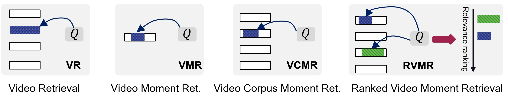

# Video Moment Retrieval in Practical Setting: A Dataset of Ranked Moments for Imprecise  Queries

The benchmark and dataset for the paper "Video Moment Retrieval in Practical Settings: A Dataset of Ranked Moments for Imprecise Queries" is coming soon.

We recommend cloning the code, data, and feature files from the Hugging Face repository at [TVR-Ranking](https://huggingface.co/axgroup/TVR-Ranking).  
  
  


## Getting started
### 1. Install the requisites

The Python packages we used are listed as follows. Commonly, the most recent versions work well.  


```shell
conda create --name tvr_ranking python=3.11
conda activate tvr_ranking
pip install pytorch # 2.2.1+cu121
pip install tensorboard 
pip install h5py pandas tqdm easydict pyyaml
```

### 2. Download full dataset
For the full dataset, please go down from Hugging Face [TVR-Ranking](https://huggingface.co/axgroup/TVR-Ranking). \
The detailed introduction and raw annotations is available at [Dataset Introduction](data/TVR_Ranking/readme.md).


```
TVR_Ranking/
  -val.json                  
  -test.json                 
  -train_top01.json
  -train_top20.json
  -train_top40.json
  -video_corpus.json
```

### 3. Download features

For the query BERT features, you can download them from Hugging Face [TVR-Ranking](https://huggingface.co/axgroup/TVR-Ranking). \
For the video and subtitle features, please request them at [TVR](https://tvr.cs.unc.edu/).

```shell
tar -xf tvr_feature_release.tar.gz -C data/TVR_Ranking/feature
```

### 4. Training
```shell
# modify the data path first 
sh run_top20.sh
```

## Baseline
(ToDo: running the new version...) \
The baseline performance of  $NDGC@20$ was shown as follows.
Top $N$ moments were comprised of a pseudo training set by the query-caption similarity.
| Model          | $N$ | IoU = 0.3, val | IoU = 0.3, test | IoU = 0.5, val | IoU = 0.5, test | IoU = 0.7, val | IoU = 0.7, test |
|----------------|-----|----------------|-----------------|----------------|-----------------|----------------|-----------------|
| **XML**        | 1   | 0.1050         | 0.1047          | 0.0767         | 0.0751          | 0.0287         | 0.0314          |
|                | 20  | 0.1948         | 0.1964          | 0.1417         | 0.1434          | 0.0519         | 0.0583          |
|                | 40  | 0.2101         | 0.2110          | 0.1525         | 0.1533          | 0.0613         | 0.0617          |
| **CONQUER**    | 1   | 0.0979         | 0.0830          | 0.0817         | 0.0686          | 0.0547         | 0.0479          |
|                | 20  | 0.2007         | 0.1935          | 0.1844         | 0.1803          | 0.1391         | 0.1341          |
|                | 40  | 0.2094         | 0.1943          | 0.1930         | 0.1825          | 0.1481         | 0.1334          |
| **ReLoCLNet**  | 1   | 0.1306         | 0.1299          | 0.1169         | 0.1154          | 0.0738         | 0.0789          |
|                | 20  | 0.3264         | 0.3214          | 0.3007         | 0.2956          | 0.2074         | 0.2084          |
|                | 40  | 0.3479         | 0.3473          | 0.3221         | 0.3217          | 0.2218         | 0.2275          |


### 4. Inferring
[ToDo] The checkpoint can all be accessed from Hugging Face [TVR-Ranking](https://huggingface.co/axgroup/TVR-Ranking).


## Citation
If you feel this project helpful to your research, please cite our work.
```

```
