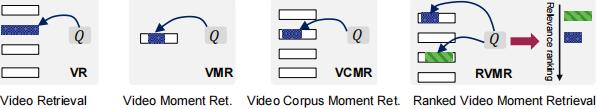

# Video Moment Retrieval in Practical Setting: A Dataset of Ranked Moments for  Imprecise  Queries

The benchmark and dataset for the paper "Video Moment Retrieval in Practical Setting: A Dataset of Ranked Moments for  Imprecise  Queries", comming soon...




> The codes are modified from [ReLoCLNet](https://github.com/26hzhang/ReLoCLNet).


## Getting started
### 1. Install the requisites

The Python packages we used were listed as follows.
Commonly, the most recent versions work well.


```shell
conda create --name tvr_ranking python=3.11
conda activate tvr_ranking
pip install pytorch # 2.2.1+cu121
pip install tensorboard 
pip install h5py pandas tqdm easydict pyyaml
```
The conda environment of [ReLoCLNet](https://github.com/26hzhang/ReLoCLNet) also works.

### 2. Download full dataset
For the full dataset, please go down from [TVR-Ranking](
https://drive.google.com/drive/folders/1QuE3Ah1VR_Sudjbl_5VFC1J-aT9Dh_WF?usp=drive_link) and organized as follows
```
TVR_Ranking/
  -val.json                  
  -test.json                 
  -train_top01.jsonl
  -train_top20.json
  -train_top40.jsonl
  -video_name_duration_id.json
```
The detailed introduction and raw annotations is available at [TVR_Ranking Introduction](data/TVR_Ranking/readme.md).

### 3. Download features

For the features of the TVR dataset, you can request them from [TVR](https://tvr.cs.unc.edu/) or download them from [TVR features on Hugging Face](https://huggingface.co/datasets/k-nick/NLVL).

```shell
tar -xf tvr_feature_release.tar.gz -C data
```

### 4. Training
```shell
# modify the data path first 
sh run_top01.sh
```

## Baseline
The baseline performance of  $NDGC@20$ was shown as follows.
Top $N$ moments were comprised of a pseudo training set by the query-caption similarity.
| Model    | $N$  | IoU = 0.3, val | IoU = 0.3, test | IoU = 0.5, val | IoU = 0.5, test | IoU = 0.7, val | IoU = 0.7, test |
|----------|----|--------------------------|---------------------------|--------------------------|---------------------------|--------------------------|---------------------------|
| **XML**      | 1  | 0.1008                   | 0.1006                    | 0.0751                   | 0.0738                    | 0.0283                   | 0.0316                    |
|          | 20 | 0.1663                   | 0.1678                    | 0.1273                   | 0.1273                    | 0.0510                   | 0.0556                    |
|          | 40 | 0.1808                   | 0.1784                    | 0.1388                   | 0.1367                    | 0.0567                   | 0.0589                    |
| **CONQUER**  | 1  | 0.1143                   | 0.1029                    | 0.0956                   | 0.0811                    | 0.0633                   | 0.0539                    |
|          | 20 | 0.2014                   | 0.1946                    | 0.1817                   | 0.1777                    | 0.1363                   | 0.1313                    |
|          | 40 | 0.2068                   | 0.1919                    | 0.1875                   | 0.1768                    | 0.1428                   | 0.1291                    |
| **ReLoCLNet** | 1  | 0.1234                   | 0.1236                    | 0.1110                   | 0.1100                    | 0.0712                   | 0.0770                    |
|          | 20 | 0.2615                   | 0.2545                    | 0.2424                   | 0.2373                    | 0.1752                   | 0.1762                    |
|          | 40 | 0.2715                   | 0.2700                    | 0.2552                   | 0.2541                    | 0.1850                   | 0.1913                    |


The checkpoint can all be accessed from [CheckPoints](https://drive.google.com/drive/folders/1hXJn-5ORA8T1Iyx6K2BK7KnUOpCQD9Na?usp=drive_link).


## Citation
If you feel this project helpful to your research, please cite our work.
```

```
